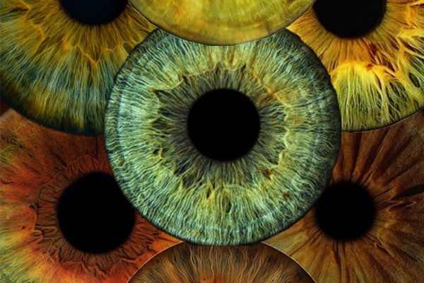

# Quand les yeux se croisent

<!-- Bannderole / Bande-annonce -->

## Description

**Quand les Yeux se Croisent** est une collection de regards humains et animaux présentée dans une installation immersive. En observant les écrans, le visiteur découvre que son propre regard s’ajoute à la collection, créant un lien entre lui, les autres et les images qui l’entourent.
<!-- Présentation de ce qu'est ce site et résumé du projet en un paragraphe, toujours à jour-->

