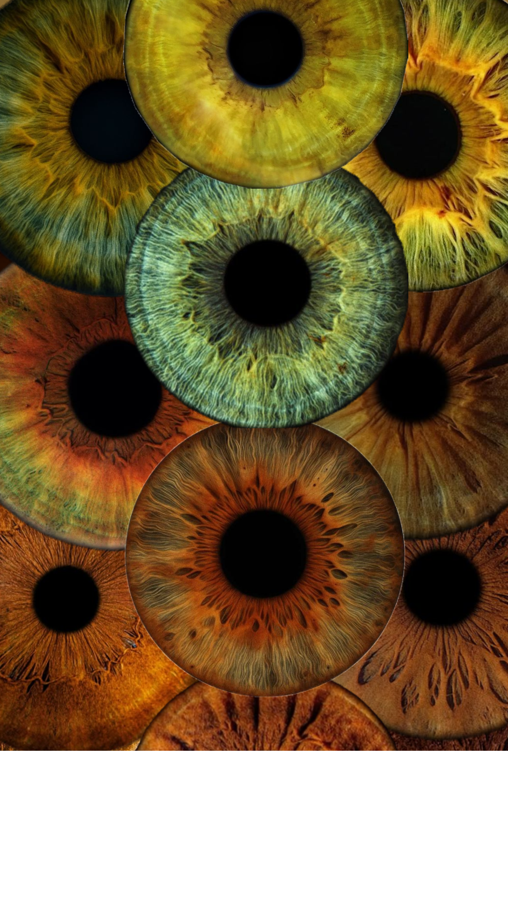

# Quand les yeux se croisent

<!-- Bannderole / Bande-annonce -->

## Description

Quand les Yeux se Croisent est une installation multimédia immersive où des télévisions rétro diffusent des images de yeux d'animaux et d'humains qui alternent et réagissent aux regards des spectateurs, transformant l’expérience visuelle et sonore en un dialogue poétique entre l’individu, le groupe et la faune.
<!-- Présentation de ce qu'est ce site et résumé du projet en un paragraphe, toujours à jour-->

