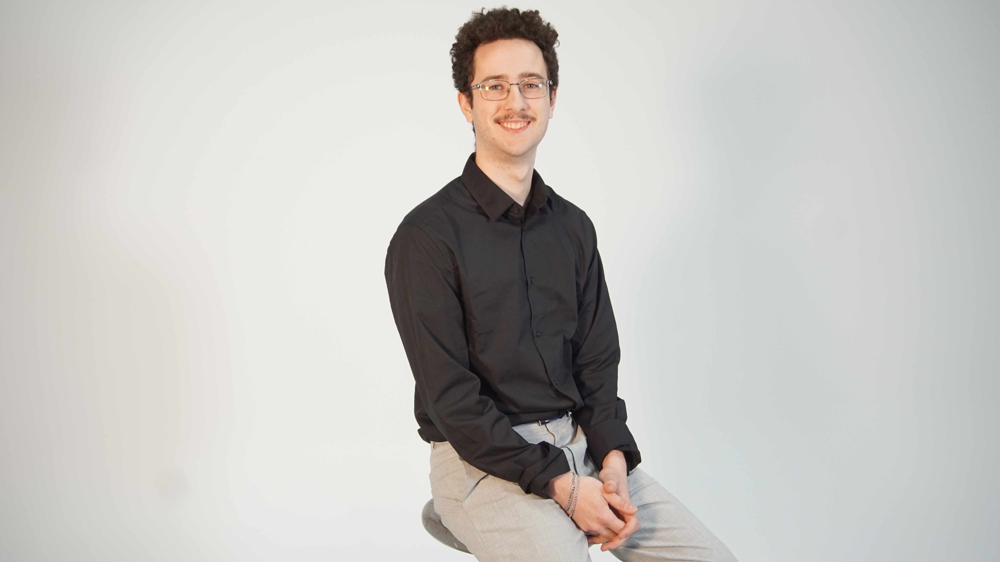

# Félix Lavoie

## Planification
Cette section, complétée lors de la première semaine, présente les tâches individuelles hebdomadaires prévues.

### Semaine 1   Réalisation de la préproduction
### Semaine 2   S'assurer du fonctionnement de la capture de l'oeil
### Semaine 3   Programation raspeberry pie
### Semaine 4   Amélioration de la capture de l'oeil
### Semaine 5   Instalation cable/lumière/audio
### Semaine 6   Intégration de la sauvegarde des yeux
### Semaine 6.5 Réglage de bugs
### Semaine 7   paufinage
### Semaine 8   présenter
## Journal de bord
Cette section, complétée quotidiennement pendant l’exécution du projet, documente le travail individuel réellement réalisé chaque jour.

### Semaine 2
#### Lundi
#### Mardi
#### Mercredi
#### Jeudi
#### Vendredi
### Semaine 3
#### Lundi
#### Mardi
#### Mercredi
#### Jeudi
#### Vendredi
### Semaine 4
#### Lundi
#### Mardi
#### Mercredi
#### Jeudi
#### Vendredi
### Semaine 5
#### Lundi
#### Mardi
#### Mercredi
#### Jeudi
#### Vendredi
### Semaine 6
#### Lundi
#### Mardi
#### Mercredi
#### Jeudi
#### Vendredi
### Semaine 6.5
#### Lundi
#### Mardi
#### Mercredi
#### Jeudi
#### Vendredi
### Semaine 7
#### Lundi
#### Mardi
#### Mercredi
#### Jeudi
#### Vendredi
### Semaine 8
#### Lundi
#### Mardi
#### Mercredi
#### Jeudi
#### Vendredi
