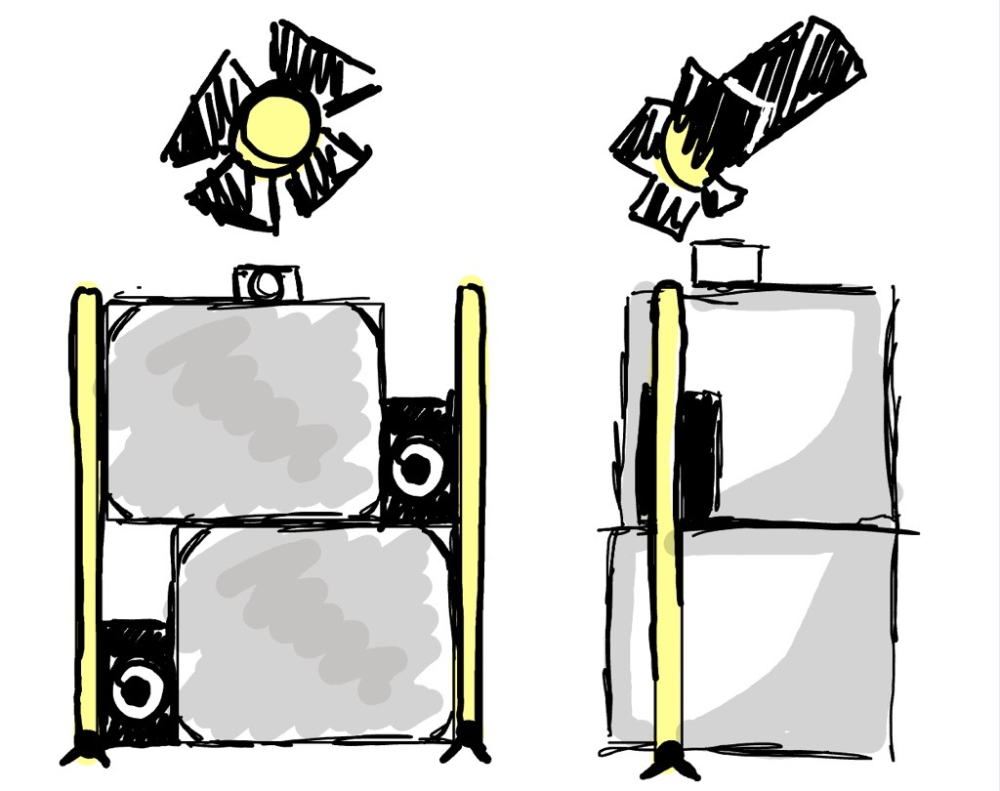

# Jade Hébert

## Planification

Cette section, complétée lors de la première semaine, présente les tâches individuelles hebdomadaires prévues.

### Semaine 1 — Cadrage du projet & démarrage

Tâches principales:

- Clarifier le concept du projet et l'équipements  
- Contraintes (temps, techniques, lieu, budget, matériel)  
- Définir les livrables finaux  
- Identifier les rôles dans l’équipe  
- Tableau de tâches Trello  
- Valider avec les enseignants  

### Semaine 2 - Recherche & pré-production

Tâches principales:

- Organiser une réunion d’alignement d’équipe (recherche visuelle, sonore et technique)  
- Valider la faisabilité technique avec le Comité Technique  
- Lister les besoins matériels  
- Achat de l'équipement audiovisuel (Télévisions, rayonnage et câblage si besoin) 

### Semaine 3 — Maquette 1

Tâches principales:

- Assemblage de la maquette 1  
  - Avoir en notre possession au moins deux télévisions
  - Avoir un montage sonore combinant l'ambiance + effets sonores d'environnement (Manel)
  - Faire une animation des lumières LED (Patricia)
  - Assembler une installation qui comprend deux haut-parleurs, un faisceau lumineux et la caméra
  - Faire fonctionner les écrans (Félix)
  - Pouvoir inclure les yeu des interacteurs dans la séquence vidéo (Edelwyn)
- Tests simples pour débogage  
- Établir un manuel de démarrage  

### Semaine 4 — Début de production

Tâches principales:

- Aide à la réalisation de la vidéo  
- Installation et adaptation aux différentes plateformes  
- Application de tests de contrôle de la qualité  

### Semaine 5 — Production intensive & intégration

Tâches principales:

- Coordonner l’intégration des différentes parties  
- Assurer le bon déroulement du tournage et de la documentation  
- Rédiger le dossier de presse  
- Assemblage de la maquette 2  
  - Avoir en notre possession toutes les télévisions
  - Avoir le montage sonore combinant l'ambiance + effets sonores d'environnement et d'animaux (Manel)
  - Faire une animation des lumières DNX (2)
  - Assembler une installation qui comprend deux haut-parleurs, deux faisceaux lumineux et deux caméras
  - Pouvoir inclure la captation des DEUX caméras dans la séquence vidéo (Edelwyn)

### Semaine 6 — Maquette 2

Tâches principales:

- Mise en ligne de la bande-annonce  
- Organiser des tests utilisateurs (Présentation publique pendant le trou à l'horaire)  
- Débuter l'installation (maquette finale) 
- Identifier les bugs  

### Semaine 6.5 - Tests & débogage

Tâches principales:

- Finir l'installation (maquette finale)  
  - Avoir en notre possession toutes les écrans (Félix)
  - Faire une animation des lumières DNX (4)
  - Cacher le câblage à l'aide de boîtes, de rideaux et d'arragement floraux (Manel, Patrica, Edelwyn)
- Vérifier la stabilité générale  
- Prioriser les corrections  
- Coordonner les correctifs  

### Semaine 7 - Finition & préparation de la présentation

Tâches principales:

- Mettre à jour le manuel de démarrage  
- Superviser les finitions visuelles et sonores  
- Vérifier la cohérence globale  
- Assurer le bon déroulement du tournage de la vidéo finale et de la documentation  
- Établir l'horaire de la semaine de présentation  
- Pratique générale  

### Semaine 8 - Semaine de présentation

Tâches principales:

- Mise en ligne de la vidéo documentation finale  
- Faire la section exposition du site Web  
- Présentation de l'oeuvre  

## Journal de bord

Cette section, complétée quotidiennement pendant l’exécution du projet, documente le travail individuel réellement réalisé chaque jour.

### Semaine 2

#### Mardi

| Heure | Tâches à faire                                                              |
| ----- | --------------------------------------------------------------------------- |
| 09:00 | Présentation du projet aux ensignants                                       |
| 14:30 | Réunion d’alignement d’équipe (son et logo)                                 |
| 16:00 | Correction du site web avec les modifications apportées par les professeurs |

#### Mercredi

| Heure | Tâches à faire                                                |
| ----- | ------------------------------------------------------------- |
| 10:00 | Réunion d’alignement d’équipe (quoi faire pour la maquette 1) |
| 11:00 | Rencontre avec Guillaume pour l'équipement                    |
| :00   |                                                               |

### Idéalisation de la maquette 1

#### Jeudi

#### Vendredi

### Semaine 3

#### Lundi

#### Mardi

#### Mercredi

#### Jeudi

#### Vendredi

### Semaine 4

#### Lundi

#### Mardi

#### Mercredi

#### Jeudi

#### Vendredi

### Semaine 5

#### Lundi

#### Mardi

#### Mercredi

#### Jeudi

#### Vendredi

### Semaine 6

#### Lundi

#### Mardi

#### Mercredi

#### Jeudi

#### Vendredi

### Semaine 6.5

#### Lundi

#### Mardi

#### Mercredi

#### Jeudi

#### Vendredi

### Semaine 7

#### Lundi

#### Mardi

#### Mercredi

#### Jeudi

#### Vendredi

### Semaine 8

#### Lundi

#### Mardi

#### Mercredi

#### Jeudi

#### Vendredi
