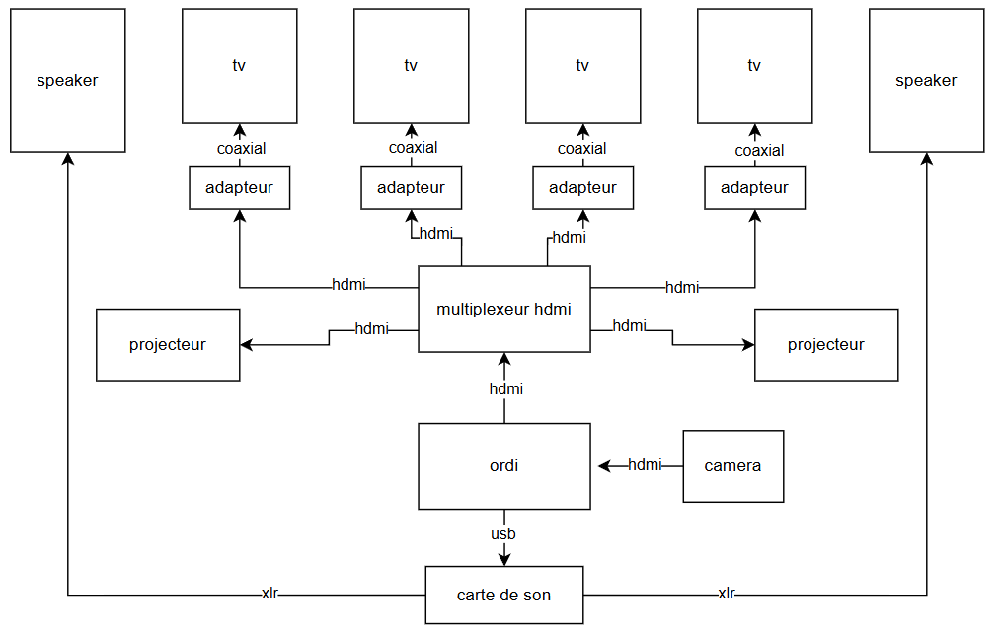
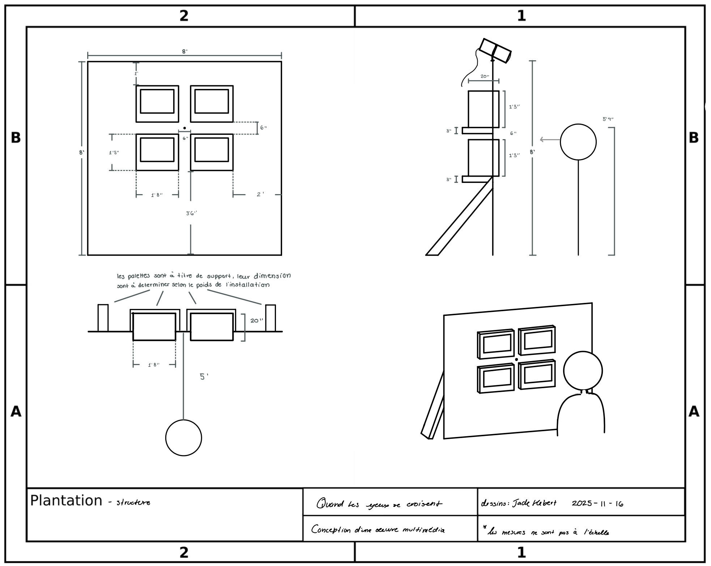
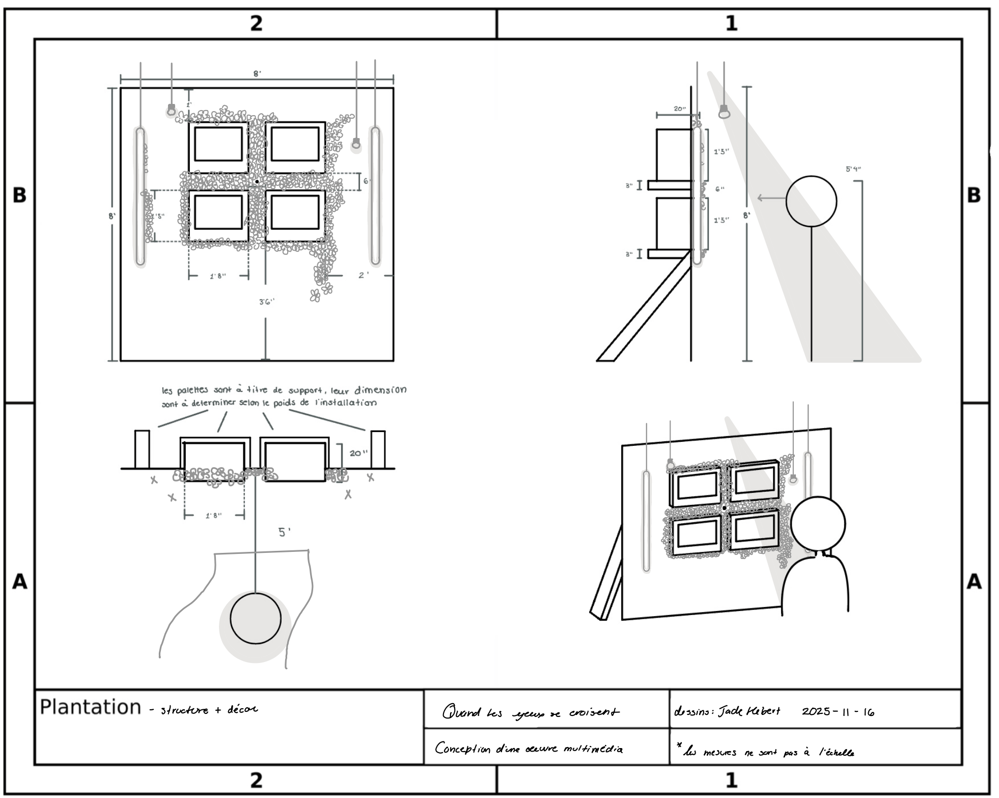
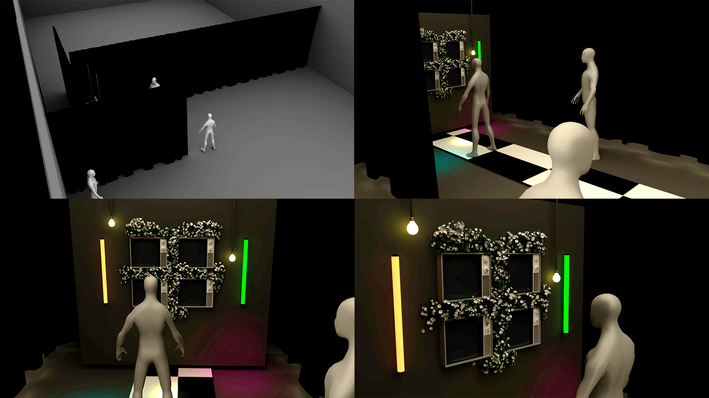

# Maquette (faisabilité)

## Scénarisation de l'interactivité

### Scène 1

| Verbe action | Condition de déclenchement                                                                    | Effet visuel                                                                                                                                  | Effet sonore                                                                                                                                                                            | Effet interactif                                                         |
| ------------ | --------------------------------------------------------------------------------------------- | --------------------------------------------------------------------------------------------------------------------------------------------- | --------------------------------------------------------------------------------------------------------------------------------------------------------------------------------------- | ------------------------------------------------------------------------ |
| Entrer       | Le visiteur suit le tapis vers l'exposition                                                   | Des empreintes d'animaux sur le tapis indiquent la direction                                                                                  | Une musique de fond organique légère boucle                                                                                                                                             | NA                                                                       |
| Se déplacer  | S'approche du faisceau lumineux qui invitent le visiteur à se positioné devant les télévisons | Les vidéos des regards d'animaux se transforment en yeux d'humains avec un effet "morph" un peu "glitché" et les lumières changent de couleur | La même musique de fond joue après un son de carillon une fois la présence captée (synchronisé avec l'effet de transformation), en y incluant maintenant des textures sonores d'animaux | L'installation "reconnait" la présence du visiteur et passe à la scène 2 |

### Scène 2

| Verbe action                      | Condition de déclenchement                                                                   | Effet visuel                                                                                                                                                                                                       | Effet sonore                                                                                                                   | Effet interactif                                         |
| --------------------------------- | -------------------------------------------------------------------------------------------- | ------------------------------------------------------------------------------------------------------------------------------------------------------------------------------------------------------------------ | ------------------------------------------------------------------------------------------------------------------------------ | -------------------------------------------------------- |
| Rester en place                   | Détection captée par le capteur (caméra)                                                     | Les yeux d'animaux de deux télévisions se transforment en l'oeil de l'interacteur et les lumières LED changent de couleur                                                                                          | La même musique de fond joue avec les textures sonores d'animaux                                                               | L'installation traduit les gestes en visuels et lumières |
| Tourne la tête                    | Capteur perd la présence de l'intéracteur après un certain temps                             | Les regards humains se transforment en animaux et les lumières redeviennent à leur état initial, c'est-à-dire des couleurs distinctes qui ont une légère animation s'apparentant à une respiration                 | La même musique de fond joue avec les textures sonores d'animaux et un son de carillon inversé lorsque la captation est perdue | Fin du cycle - passe à la scène 3                        |
| Caméra obstruée                   | Capteur perd la présence de l'intéracteur après un certain temps                             | Les regards humains se transforment en animaux et les lumières redeviennent à leur état initial, c'est-à-dire des couleurs distinctes qui ont une légère animation s'apparentant à une respiration                 | La même musique de fond joue avec les textures sonores d'animaux et un son de carillon inversé lorsque la captation est perdue | Fin du cycle - passe à la scène 3                        |
| Reste trop longtemps              | Une fois que l'interacteur reste plus de 2min                                                | Les regards humains se transforment en animaux et les lumières redeviennent à leur état initial, c'est-à-dire des couleurs distinctes qui ont une légère animation s'apparentant à une respiration                 | La même musique de fond joue avec les textures sonores d'animaux et un son de carillon inversé lorsque le temps s'est écoulé   | Fin du cycle - passe à la scène 3                        |
| Plusieurs personnes présentes     | Mouvements captés de la première personne captée                                             | Les yeux d'animaux de deux télévisions se transforment en l'oeil de la première personne captée et les lumières LED changent de couleur                                                                            | La même musique de fond joue avec les textures sonores d'animaux                                                               | L'installation traduit les gestes en visuels et lumières |
| Se déplace de gauche à droite     | Mouvements captés par le capteur (caméra)                                                    | Les yeux de deux télévisions, maintenant de l'interacteur, reflètent le mouvement de la personne, donc suit celle-ci                                                                                               | La même musique de fond joue avec les textures sonores d'animaux                                                               | L'installation traduit les gestes en visuels et lumières |
| Se déplace de l'arrière à l'avant | Mouvements captés par le capteur (caméra)                                                    | Les yeux de deux télévisions, maintenant de l'interacteur, reflètent le mouvement de la personne, donc suit celle-ci si elle se rapproche ou s'éloigne                                                             | La même musique de fond joue avec les textures sonores d'animaux                                                               | L'installation traduit les gestes en visuels et lumières |
| Sauter                            | Mouvements captés par le capteur (caméra) ou risque de perte de la présence de l'intéracteur | Les yeux de deux télévisions, maintenant de l'interacteur, reflètent le mouvement de la personne, mais peuvent se retransformer en animaux si le mouvemnent est trop rapide / le saut est trop haut pour le suivis | La même musique de fond joue avec les textures sonores d'animaux                                                               | L'installation traduit les gestes en visuels et lumières |

### Scène 3

| Verbe action | Condition de déclenchement | Effet visuel                                                                                                                                                                                                                                 | Effet sonore                                                     | Effet interactif   |
| ------------ | -------------------------- | -------------------------------------------------------------------------------------------------------------------------------------------------------------------------------------------------------------------------------------------- | ---------------------------------------------------------------- | ------------------ |
| Quitter      | Inactivité totale          | Les télévisons alternent entre des yeux d'animaux et les yeux d'humains déjà enregistrés et les lumières redeviennent à leur état initial, c'est-à-dire des couleurs distinctes qui ont une légère animation s'apparentant à une respiration | La même musique de fond joue avec un son de respiration | Passe à la scène 1 |

## Équipements

- Télévisions cathodique (x4)
- Guirllande de lumière (x1)
- Bouquet fleurs blanches (x6)
- Tapis noir et blanc (x4)
- Lumières LED (x6)
- Camera (x1)
- Ordinateur (x1)
- Spotlight (x4)
- Speaker (x2)
- Projecteur (x2)
- Coaxial cable (x4)
- Caxial to HDMI (x4)
- Cable DNX (x2)
- Cable HDMI (x7)
- Multi prise (x4)
- Carte de son (x1)
- Multiplexeur HDMI (x1)

---

## Logiciels

- Touch Designer
- Pure Data
- Visual Studio Code
- Hyper HDR

---

## Synoptique

## Plan d'implantation

Plans d'implantation 2D

Plan d'implantation 3D

## Budget estimé

- Télévisions cathodique (x2 75$/px)
- Lumières suspendues (x1 20$/px)
- Bouquet fleurs blanches (x6 21$/px)
- Tapis noir et blanc (x4 30$/px)
- Total: 416$ (avant tax)
