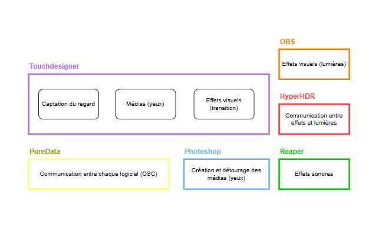
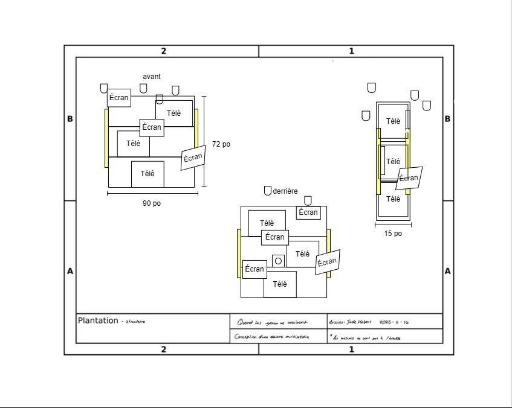

# Technique

## Équipements

**Équipement audiovisuel**
| Nom | Disponibilité | Quantité |
|-------------------------|---------------|----------|
| Télévision cathodique | X | 3 |
| Caméra Sony A6500| ✔ | 1 |
| Ordinateur | ✔ | 1 |
| Haut-parleurs | ✔ | 2 |
| Carte de son | ✔ | 1 |
| Carte de capture hdmi | ✔ | 1 |
| Pile de camera filaire | ✔ | 1 |
| Switch ethernet poe | ✔ | 1 |
| Kit raspberry pie avec écran (Guillaume) | ✔ | 8 |

**Éclairage**
| Nom | Disponibilité | Quantité |
|--------------------|---------------|----------|
| Ampoule lumineuse | ✔ | 6 |
| Lumière LED | ✔ | 4 |
| Lumière DMX | ✔ | 2 |
| Spotlight | ✔ | 1 |

**Accessoires et décor**
| Nom | Disponibilité | Quantité |
|-----------------------------|---------------|----------|
| Bouquet de fleurs blanches | ✔ | 6 |
| Tissu noir | X | à determiner |

**Câblage**
| Nom | Disponibilité | Quantité |
|-------------------------------|---------------|----------|
| Câble rca | ✔ | 3 |
| Adaptateur av vers HDMI | X | 3 |
| Câble xlr | ✔ | 4 |
| Câble Ethernet | ✔ | 9 |
| Câble HDMI | ✔ | 3 |
| Multiprise | X | 4 |

## Logiciels

### - Midjourney

Générer les médias nécessaires au projet grâce à l'intelligence artificiel

### - Photoshop

Modifier les médias générés afin de les rendent interactifs

### - Touch Designer

Créer des expériences visuelles interactives avec Media Pipe  
Générer des animations en temps réel  
Connecter des capteurs ou données externes avec OSC

### - Pure Data

Concevoir des systèmes audio interactifs avec OSC

### - Reaper

Créer des expériences auditives interactives avec l'OSC

### - Hyper HDR

Connecter avec les lumières avec OBS

### - OBS

Relier les expériences visuelles interactive pour les lumières

## Synoptique

### Branchements

### Logiciels

## Plan d'implantation

Plans d'implantation 2D

Plan d'implantation 3D

## Budget estimé

| Nom      | Prix | Quantité |
| -------- | ---- | -------- |
| À revoir | $    | x        |

Total:
