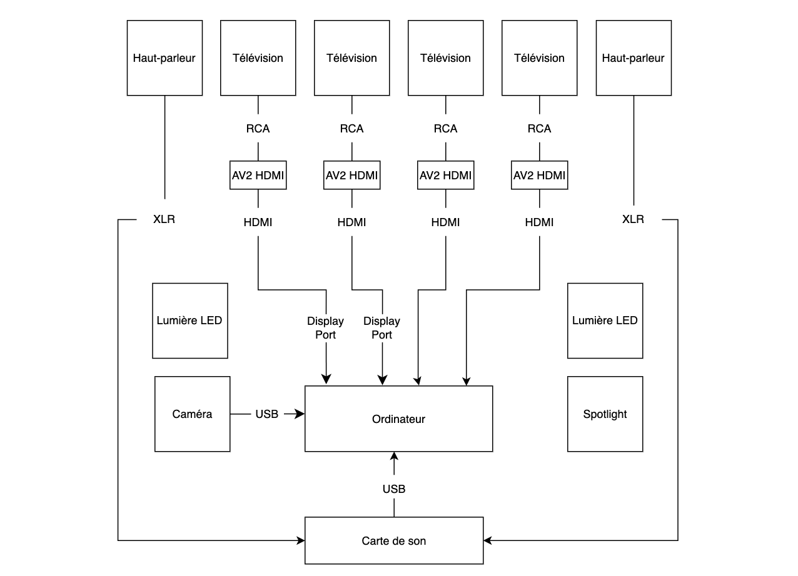
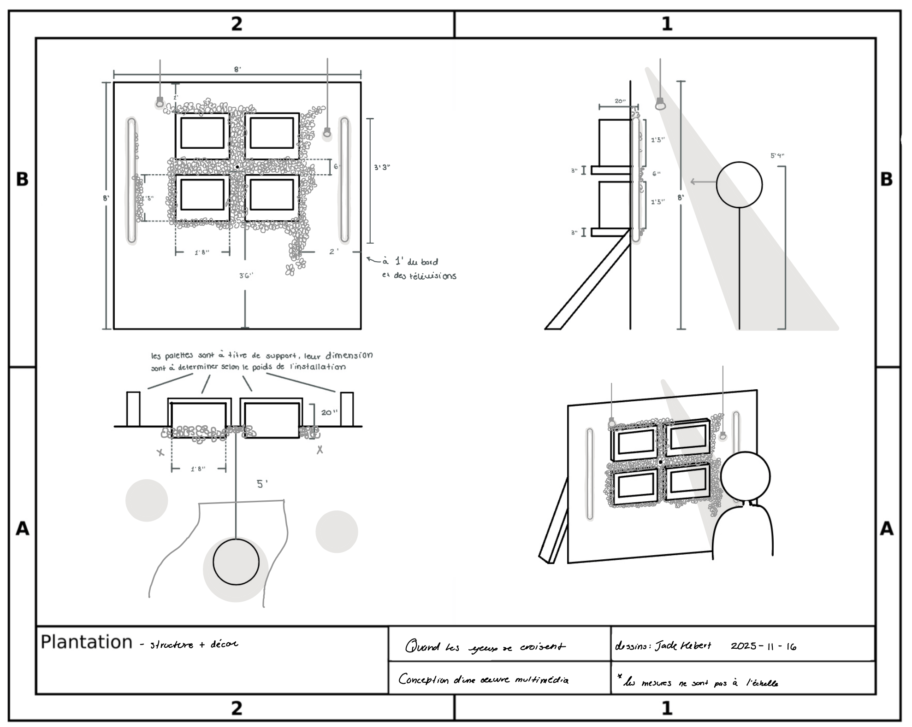

# Technique

## Équipements
**Équipement audiovisuel**
| Nom | Disponibilité | Quantité |
|-------------------------|---------------|----------|
| Télévision cathodique | X | 4 |
| Caméra Sony A6500| ✔ | 1 |
| Ordinateur | ✔ | 1 |
| Haut-parleurs | ✔ | 2 |
| Carte de son | ✔ | 1 |

**Éclairage**
| Nom | Disponibilité | Quantité |
|--------------------|---------------|----------|
| Ampoule lumineuse | ✔ | 6 |
| Lumière LED | ✔ | 2 |
| Lumière DMX | ✔ | 2 |
| Spotlight | ✔ | 1 |

**Accessoires et décor**
| Nom | Disponibilité | Quantité |
|-----------------------------|---------------|----------|
| Bouquet de fleurs blanches | ✔ | 6 |
| Tapis noir et blanc | X | 4 |

**Câblage**
| Nom | Disponibilité | Quantité |
|-------------------------------|---------------|----------|
| Câble coaxial | ✔ | 4 |
| Adaptateur coaxial vers HDMI | X | 4 |
| Câble DMX | ✔ | 2 |
| Câble Ethernet | ✔ | 1 |
| Câble HDMI | ✔ | 7 |
| Multiprise | X | 4 |

## Logiciels
### - Midjourney

Générer les médias nécessaires au projet grâce à l'intelligence artificiel

### - Photoshop

Modifier les médias générés afin de les rendent interactifs

### - Touch Designer

Créer des expériences visuelles interactives avec Media Pipe  
Générer des animations en temps réel  
Connecter des capteurs ou données externes avec OSC

### - Pure Data

Concevoir des systèmes audio interactifs avec OSC

### - Reaper

Créer des expériences auditives interactives avec l'OSC

### - Hyper HDR

Connecter avec les lumières avec OBS

### - OBS

Relier les expériences visuelles interactive pour les lumières

## Synoptique
### Branchements

### Logiciels

## Plan d'implantation

Plans d'implantation 2D

Plan d'implantation 3D

## Budget estimé
| Nom                     | Prix | Quantité  |
| ----------------------- | ---- | --------- |
| Télévisions cathodiques | 75$  | 3         |
| Bouquet fleurs blanches | 25$  | environ 6 |
| Tapis noir et blanc     | 30$  | 4 mrcx    |
| Plywood 4' x 8'         | 25$  | 2         |
| Adaptateur              | 20$  | 4         |

Total: 625$ (sans taxes)
