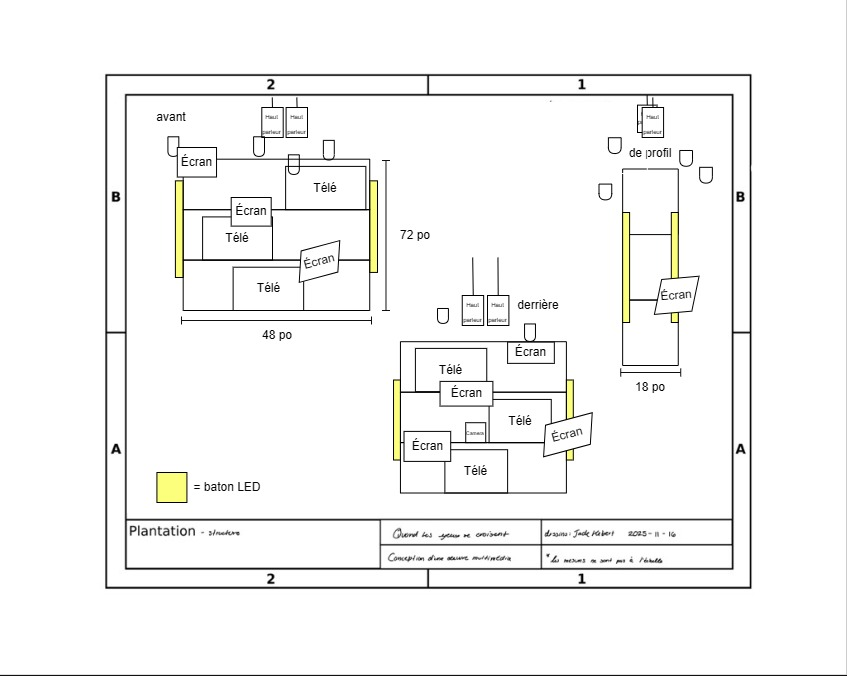
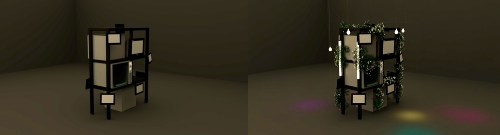

# Technique

## Équipements

**Équipement audiovisuel**
| Nom | Disponibilité | Quantité |
|-------------------------|---------------|----------|
| Télévision cathodique | ✔ | 1 |
| Caméra Sony A6500| ✔ | 2 |
| trepied| ✔ | 2 |
| Clef touch designer | ✔ | 1 |
| Ordinateur | ✔ | 1 |
| Laptop | ✔ | 1 |
| Haut-parleurs | ✔ | 2 |
| Carte de son | ✔ | 1 |
| Carte de capture HDMI | ✔ | 2 |
| Pile de camera filaire | ✔ | 2 |
| Switch Ethernet poe | ✔ | 1 |
| Kit raspberry pie avec écran (Guillaume) | ✔ | 8 |
| Raspberry pie 4 ndi (Guillaume) | ✔ | 4 |
| pole extensible avec pince mathews | ✔ | 4 |
| Casque écouteur | ✔s | 1 |

**Éclairage**
| Nom | Disponibilité | Quantité |
|--------------------|---------------|----------|
| Lumière LED | ✔ | 4 |
| Lumière DMX | ✔ | 4 |
| Spotlight | ✔ | 2 |

**Accessoires et décor**
| Nom | Disponibilité | Quantité |
|-----------------------------|---------------|----------|
| Bouquet de fleurs blanches | X | 6 |
| Tissu noir | ✔ | à determiner |

**Câblage**
| Nom | Disponibilité | Quantité |
|-------------------------------|---------------|----------|
| Câble RCA | ✔ | 1 |
| Adaptateur AV vers HDMI / Display Port | ✔ | 1 |
| Câble XLR | ✔ | 4 |
| Câble Ethernet | ✔ | 9 |
| Câble Micro USB | ✔ | 2 |
| Câble HDMI | ✔ | 2 |
| Câble Display Port | ✔ | 2 |
| Multiprise | ✔ | 4 |
| trrs | ✔ | 4 |

## Logiciels

### - Midjourney

Générer les médias nécessaires au projet grâce à l'intelligence artificiel

### - Photoshop

Modifier les médias générés afin de les rendent interactifs

### - Touch Designer

Créer des expériences visuelles interactives avec Media Pipe  
Générer des animations en temps réel  
Connecter des capteurs ou données externes avec OSC

### - Pure Data

Concevoir des systèmes audio interactifs avec OSC

### - Reaper

Créer des expériences auditives interactives avec l'OSC

### - Hyper HDR

Connecter avec les lumières avec OBS

### - QLC +

Faire des animations simples pour les lumières DMX

### - OBS

Relier les expériences visuelles interactive pour les lumières

### - FL Studio

Créer des expériences auditives

## Synoptique

### Branchements

## Plan d'implantation

Plans d'implantation 2D

Plan d'implantation 3D

## Budget estimé

| Nom                    | Prix    | Quantité |
| ---------------------- | ------- | -------- |
| Rayonnage              | 268$    | 1        |
| Télévision cathodiques | max 60$ | 2        |
| Fleurs                 | 74.22$  | 6        |

Total: 513.55$
